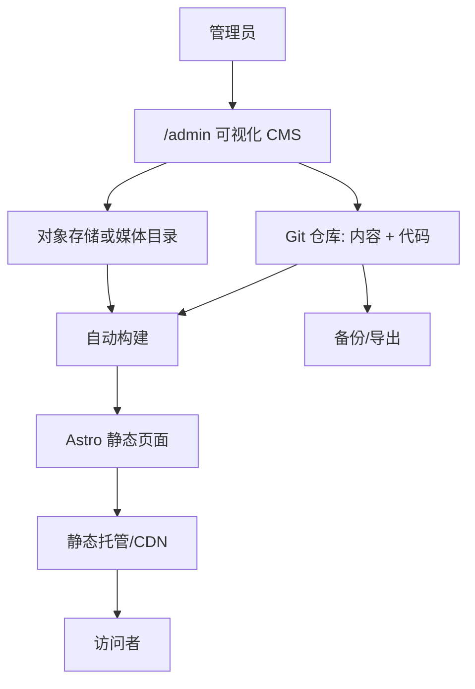

# 系统架构设计

## 1. 推荐技术栈

- 前端：Astro。
- 内容管理：Keystatic。
- 内容格式：Markdown/MDX + YAML/JSON 配置文件。
- 样式：原生 CSS 或轻量 CSS 架构，后续如需组件效率可评估 Tailwind CSS，但不作为阶段 0 强制项。
- 图片：Astro Image 或构建期图片优化，初期本地媒体目录，后续可迁移对象存储。
- 部署：优先 Cloudflare Pages；中日访问平衡可选 Cloudflare Pages 或香港/日本静态托管；中国大陆正式部署可迁移到国内云静态托管/CDN/对象存储。
- 仓库：由网站所有者控制的 Git 仓库。

## 2. 技术选型原因

Astro 适合内容型个人网站，默认以静态生成为主，可以减少前端 JavaScript、提升 SEO 和访问性能。官方内容集合支持本地 Markdown、MDX、YAML、TOML、JSON，也支持从 CMS、数据库或 API 获取内容，并提供 schema 校验和类型安全。

Keystatic 适合低维护、Git 友好的可视化内容管理。它可以将内容保存到本地文件系统、GitHub 或两者，和 Astro 集成成本低，不要求传统数据库。内容以文件形式保存，利于导出、备份、审阅和迁移。

## 3. 前端方案比较

| 方案           | 优点                                                      | 缺点                                         | 结论       |
| -------------- | --------------------------------------------------------- | -------------------------------------------- | ---------- |
| Astro          | 静态生成强、JS 少、SEO 友好、内容集合成熟、适合个人内容站 | 大型交互应用能力不如全栈框架直接             | 推荐       |
| Next.js        | 生态大、全栈能力强、CMS 集成多                            | 对纯内容站偏重，运行模式和部署复杂度更高     | 备选       |
| Hugo/Eleventy  | 极快、静态、低成本                                        | 可视化 CMS 集成和现代组件体验较弱            | 备选       |
| WordPress 主题 | 后台成熟、可视化强                                        | 数据库和运维负担更高，迁移与安全维护成本更高 | 不作为首选 |

## 4. CMS 方案比较

| 方案         | 可视化 | 数据库                           | 迁移                      | 图片管理          | 多语言   | 权限                    | 成本                   | 结论             |
| ------------ | ------ | -------------------------------- | ------------------------- | ----------------- | -------- | ----------------------- | ---------------------- | ---------------- |
| Keystatic    | 强     | 不需要                           | 文件/Git 友好             | 支持图片/文件字段 | 可设计   | 依赖部署模式和 Git 权限 | 可低成本               | 推荐             |
| TinaCMS      | 强     | 不需要传统数据库，可用 TinaCloud | Git 友好                  | 支持              | 支持     | 云服务权限较好          | 免费层有限，团队版收费 | 备选             |
| Decap CMS    | 中     | 不需要                           | Git 友好                  | 支持              | 可设计   | 依赖身份服务            | 免费                   | 备选，但体验较旧 |
| Headless CMS | 强     | 通常需要                         | 取决于供应商              | 强                | 通常强   | 强                      | 可能收费               | 适合后续扩展     |
| WordPress    | 很强   | 需要                             | 可导出但主题/API 绑定较多 | 强                | 插件实现 | 强                      | 主机和维护成本         | 不推荐初期       |
| 自建后台     | 可定制 | 通常需要                         | 可控                      | 可控              | 可控     | 可控                    | 开发和维护成本高       | 不推荐初期       |

## 5. 前端架构

- `src/pages/[lang]/`：多语言路由。
- `src/layouts/`：基础布局、文章布局、项目布局。
- `src/components/`：导航、页脚、卡片、标签、SEO、语言切换。
- `src/content/`：内容集合，如文章、项目、作品、时间轴。
- `src/data/`：站点设置、首页配置、导航等单例数据。
- `public/` 或 `src/assets/`：静态媒体资源，依据图片优化方式最终确定。

P1 已创建 `src/components`、`src/layouts`、`src/styles` 和 `src/lib`，用于公共框架和设计系统；P2 以后再增加正式业务页面。

## 6. CMS 架构

P0 的 `/admin` 是用户入口，会转到 Keystatic Astro 集成实际提供的 `/keystatic` 路由。推荐使用 Keystatic 管理内容：

- Collections：Project、Article、PortfolioItem、Experience、Education、TimelineItem、Category、Tag、MediaAsset。
- Singletons：Profile、SiteSettings、Homepage、Navigation、SEO defaults。
- P0 使用 `storage.kind: local`，内容写入本地仓库文件；P9 再切换 GitHub mode。
- Project P0 最小字段为 `title`、`slug`、`summary`、`body`、`coverImage`、`status`、`featured`、`sortOrder`、`publishedAt`、`draft`。
- SiteSettings P0 只保留网站名称和默认语言，作为 singleton 验证。
- P1 通过 `src/lib/site-config.ts` 提供 SiteSettings reader 接口和占位默认值；网站名称、描述、导航、Footer 链接、邮箱和语言集合可在后续接入 CMS，不写死在布局组件中。
- 发布后触发自动构建，静态网站更新。

## 7. 内容存储方式

推荐：

- 文章正文：Markdown 或 MDX。
- 项目和作品详情：Markdown/MDX + frontmatter。
- 结构化设置：首页、导航、SEO、Profile：YAML 或 JSON。
- 多语言：每条内容使用 `translationKey` 关联三种语言版本，或模型内使用 `zh/ja/en` 对象字段。推荐内容较长的模型按语言拆文件，短配置使用多语言对象字段。

### Markdown、富文本、区块编辑器比较

| 编辑方式     | 优点                                         | 缺点                             | 结论                |
| ------------ | -------------------------------------------- | -------------------------------- | ------------------- |
| Markdown/MDX | 可迁移、Git 友好、适合文章和技术内容、易备份 | 非技术用户初期需适应             | 推荐作为底层格式    |
| 富文本编辑器 | 上手容易、所见即所得                         | 输出结构可能不稳定，迁移成本较高 | 可作为 CMS 编辑体验 |
| 区块编辑器   | 结构清晰，适合复杂页面                       | 配置复杂，维护成本更高           | 用于首页区块可选    |

推荐：底层保存 Markdown/MDX，后台提供可视化编辑字段和必要的区块字段。文章支持标题、段落、图片、引用、列表、链接、表格、代码块、分隔线、小标题。

## 8. 图片存储方式

初期推荐：

- 少量图片放入 Git 仓库的媒体目录，便于备份和迁移。
- 限制单张图片大小和格式。
- 构建时生成响应式图片。

后续图片较多时：

- 迁移到对象存储，如 Cloudflare R2、Backblaze B2、AWS S3、阿里云 OSS、腾讯云 COS。
- 保留导出清单，避免图片 URL 被平台锁定。

## 9. 登录方式

推荐优先级：

1. P0 本地模式：仅用于本机开发，不作为生产后台登录方案。
2. P9 GitHub mode：通过 GitHub 身份保护后台写入权限；密钥只放部署平台环境变量。
3. 中国大陆正式部署：后台可改为内网/VPN/访问控制保护，或转向自托管 CMS。

无论采用哪种方式，后台不应作为公开页面被搜索引擎索引。

## 10. 多语言架构

- URL：`/zh/`、`/ja/`、`/en/`。
- 默认语言：建议 `/zh/`，根路径 `/` 302 或静态跳转到默认语言。
- 语言切换：根据当前内容的 `translationKey` 找对应语言版本。
- SEO：每个语言页面独立 title/description/canonical，并输出 `hreflang`。
- 未翻译内容：不生成对应语言详情页，或回退默认语言并明确标记；推荐正式上线时不生成未翻译详情页。

## 11. 构建流程

1. 管理者在 `/admin` 编辑内容。
2. 内容保存到 Git。
3. Git 推送触发托管平台自动构建。
4. Astro 读取内容集合，生成静态页面。
5. 部署到 CDN/静态托管。

P1 的 `/style-guide` 为 noindex 内部验收页；生产构建允许生成该页，但不会进入公开导航和 sitemap。P1 不引入大型 UI 库、动画库、外部图标 CDN 或分析脚本。

## 12. 部署流程

- P0 建立 Git 仓库和环境变量模板。
- P1-P8 开发和验证。
- P9 选择部署方案并绑定域名。
- 每次内容更新后自动部署。

## 13. 备份流程

- Git 仓库保存代码和内容。
- 媒体目录或对象存储定期导出。
- 环境变量单独保存在密码管理器。
- 每月导出完整内容包。
- 重要发布前打 Git tag。

## 14. 迁移方案

- 更换托管平台：重新配置构建命令、环境变量、域名 DNS。
- 更换 CMS：保留 Markdown/MDX 和 YAML/JSON 内容，重写 CMS schema，前端尽量不改。
- 迁移图片：导出媒体目录或对象存储，更新媒体 base URL。
- 迁移到中国大陆：完成 ICP 备案，迁移静态托管/CDN/对象存储到国内云，替换境外服务依赖。

## 15. 架构图

## 16. 参考依据

- Astro 内容集合支持本地和远程内容、schema 校验、静态和 live collection：https://docs.astro.build/en/guides/content-collections/
- Astro 官方支持 i18n 路由：https://docs.astro.build/en/guides/internationalization/
- Keystatic 官方说明可保存到本地文件系统、GitHub 或两者：https://keystatic.com/docs/introduction
- Decap CMS 是开源 Git-based CMS：https://decapcms.org/docs/intro/
- TinaCMS 有免费层和收费团队层：https://tina.io/pricing

## P2 页面与内容读取

首页、关于我和公共页脚从 `src/data/*.yaml` 读取 Keystatic singleton。首页区块通过 `sectionOrder` 和 `sectionVisibility` 控制，推荐项目复用 P0 Project collection，只展示已发布且推荐的项目。个人资料先经过公开字段过滤，法定姓名、所在地、邮箱和简历不会因内容存在而自动输出。P2 不引入数据库，不允许任意 HTML 或自由页面搭建。
